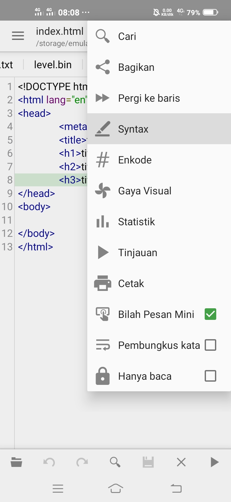
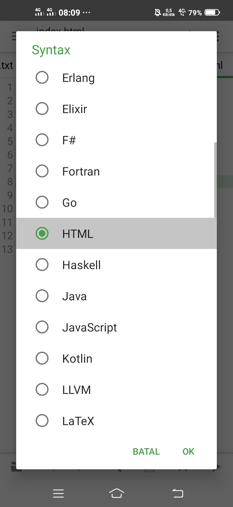

# freeWebsite
<pre>
1. Allow Storage permission
2. pkg install php
3. cd /sdcard
4. ls (OPTIONAL)
5. mkdir (foldername)
6. php -S localhost:8080
</pre>
# How to edit the website

### 1. Open QuickEdit
### 2. Click Syntax

### 3. Click HTML

### 4. Make code 
<a href="https://www.google.com">Download template</a>

